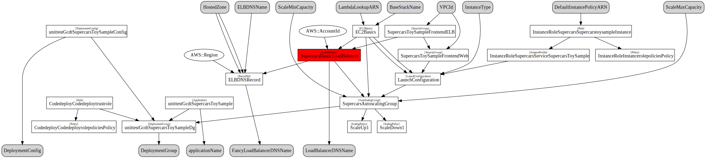

## Cloudformation Deploy Tool  
### kumo (雲 from Japanese: cloud)

### Usage

To see available commands, call kumo without any arguments:

```bash
$ kumo
Usage:
        kumo deploy [--override-stack-policy]
        kumo list
        kumo delete -f
        kumo generate
        kumo preview
        kumo version
        kumo dot
```

### Commands

#### deploy
will create or update a CloudFormation stack

to be able to update a stack that is protected by a stack policy you need to supply "--override-stack-policy"

#### list
will list all available CloudFormation stacks

#### delete
will delete a CloudFormation stack

#### generate
will generate the CloudFormation template for the given stack and write it to your current working directory.

#### preview
will create a CloudFormation ChangeSet with your current changes to the template

#### version
will print the version of gcdt you are using

#### dot
Visualize the cloudformation template of your stack using `kumo dot`.



Installation of the dot binary is required on your Mac to convert the graph into svg (http://www.graphviz.org/Download_macos.php).

``` bash
$ brew install graphviz
```

### Folder Layout

The folder layout looks like this:


cloudformation.py -> creates troposphere template, needs a method like this:

``` python
def generate_template():
    return t.to_json()
```

settings_dev.conf -> settings for dev in [hocon](https://github.com/typesafehub/config/blob/master/HOCON.md) format, needs to include all parameters for the cloudformation template + stack name

settings_prod.conf -> settings for prod in [hocon](https://github.com/typesafehub/config/blob/master/HOCON.md) format, needs to include all parameters for the cloudformation template + stack name

#### Config file example

```text
cloudformation {
  StackName = "sample-stack"
}
```

### Howto
1. create a new local folder from the template: `kumo scaffold`
2. fill `cloudformation.py`with the contents of your stack
3. fill `settings_ENV.conf`with valid parameters for your CloudFormation template
4. call `kumo validate`to check your template for errors
5. call `kumo deploy`to deploy your stack to AWS

### Hooks
kumo offers numerous hook functions that get called during the lifecycle of a kumo deploy run:

* pre_hook()
  * gets called before everything else - even config reading. Useful for e.g. creating secrets in credstash if they don't exist
* pre_create_hook()
  * gets called before a stack is created
* pre_update_hook()
  * gets called before a stack is updated
* post_create_hook()
  * gets called after a stack is created
* post_update_hook()
  * gets called after a stack is updated
* post_hook()
  * gets called after a stack is either updated or created

You can basically call any custom code you want. Just implement 
the function in cloudformation.py

multiple ways of using parameters in your hook functions:

* no arguments (as previous to version 0.0.73.dev0.dev0)
* use kwargs dict and just access the arguments you need e.g. "def pre_hook(**kwargs):"
* use all positional arguments e.g. "def pre_hook(awsclient, config, parameters, stack_outputs, stack_state):"
* use all arguments as keyword arguments or mix.
* with version 0.0.77 we decided to move away from using boto_sessions towards awsclient (more flexible and low-level).


### Using gcdt functionality in your cloudformation templates

Historically `cloudformation.py` templates imported functionality from gcdt and glomex_utils packages. With version 0.0.77 we consolidated and copied `get_env` over to gcdt.utils.

Made functionality available in gcdt (sounds awful but it was there already anyway) :
* gcdt.utils: get_env now available

Continued no changes:
* gcdt.iam: IAMRoleAndPolicies 

The following functionality requires `awsclient` to lookup information from AWS. The `awsclient` is available in the cloudformation template only within the scope of a hook (see above). Consequently you need to execute your calls within the scope of a hook:
* gcdt.servicediscovery: get_outputs_for_stack 
* gcdt.route53: create_record 
* gcdt.kumo_util: ensure_ebs_volume_tags_autoscaling_group


### Stack Policies
kumo does offer support for stack policies. It has a default stack policy that will get applied to each stack:

```json
{
  "Statement" : [
    {
      "Effect" : "Allow",
      "Action" : "Update:Modify",
      "Principal": "*",
      "Resource" : "*"
    },
    {
      "Effect" : "Deny",
      "Action" : ["Update:Replace", "Update:Delete"],
      "Principal": "*",
      "Resource" : "*"
    }
  ]
}        
```
This allows an update operation to modify each resource but disables replacement or deletion. If you supply "--override-stack-policy" to kumo then it will use another default policy that gets applied during updates and allows every operation on every resource:


```json
{
  "Statement" : [
    {
      "Effect" : "Deny",
      "Action" : "Update:*",
      "Principal": "*",
      "Resource" : "*"
    }
  ]
}
```

If you want to lock down your stack even more you can implement two functions in your cloudformation.py file:

* get_stack_policy()
* * the actual stack policy for your stack
* get_stack_policy_during_update()
* * the policy that gets applied during updates

These should return a valid stack policy document which is then preferred over the default value. 
